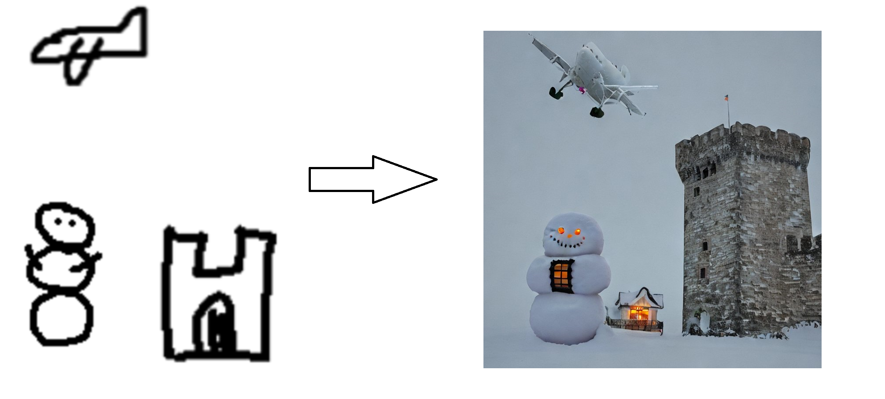

# DoodleRecognition
This is a repository that contain the scripts I used for training models for doodle recognition and turning it into a prompt which can then be used for a text-to-image machine learning model.

The classification model is trained on the Google quickdraw dataset, which has been made publicly available. Learn more about this here : https://quickdraw.withgoogle.com/data.

The recognition of the doodles is done by first finding each sepparate doodle in an image, then classifying them using several pretrained classification models (using the bagging method where they can each vote on classification), then using a simple prompgeneration. The promp generation simply looks at the position of each doodle and
whether they are on the same horizontal line.

The final step, prompt-to-image is not done in real time, but can be done with any publicly available stable diffusion image generators. For a demo verion, you could
use the one at huggingface, https://huggingface.co/spaces/stabilityai/stable-diffusion.

